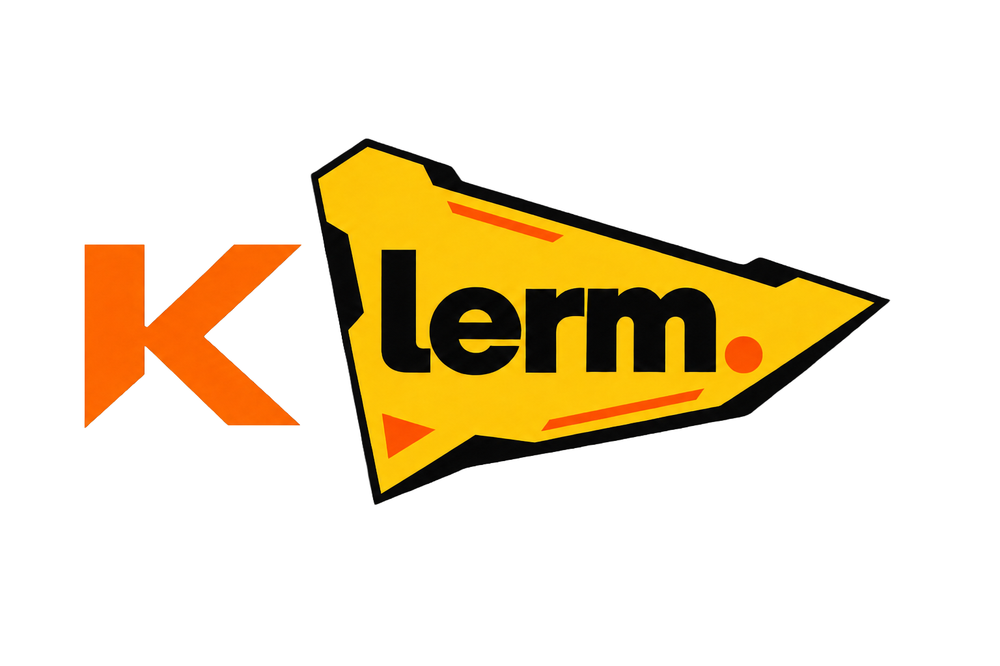

<p align="center">
  
</p>

# Klerm

Klerm is an agent-to-agent (A2A) coding system that routes work between a local
model and a configured frontier model. It provides an interactive terminal UI,
multi-provider model access, coding tools, persistent routing configuration,
and deterministic JSONL decision logs.

## Current Capabilities

- Interactive `klerm` terminal UI with read, edit, write, and shell tools.
- Local model discovery through Ollama and llama.cpp.
- Frontier workers through configured providers such as OpenAI Codex or Google.
- `off`, `local`, `frontier`, and `auto` routing modes.
- Local-to-frontier handoff in the same session through `delegate_frontier`.
- Provider-neutral handoff context between different model APIs.
- Deterministic per-project routing logs.

## Install From Source

Klerm currently requires Node.js 22.19 or newer.

```bash
git clone https://github.com/huncijr/Klerm.git
cd Klerm/harness
npm install --ignore-scripts
npm run build:offline
npm link --ignore-scripts --workspace=@earendil-works/pi-coding-agent
```

The inherited workspace package name in the final command is retained for
build compatibility. The installed executable and user-facing product are
named `klerm`.

Start Klerm in any project:

```bash
cd /path/to/project
klerm
```

Run the current source checkout without linking or rebuilding:

```bash
cd /path/to/project
/path/to/Klerm/harness/klerm-test.sh
```

Klerm stores user configuration under `~/.klerm/agent/`.

## Direct Model Use

Use `/model` in the interactive CLI to select the direct model. Direct mode is
active when A2A routing is off.

```bash
klerm --list-models
klerm --model google/gemini-3.5-flash-lite
klerm --model google/gemini-3.5-flash-lite -p "Say exactly: ok"
```

The selected provider must be authenticated. Set its API key before starting
Klerm, or run `/login` inside the interactive CLI for a supported subscription
provider.

## Local Worker

Klerm discovers installed Ollama models without downloading them automatically.

```bash
ollama pull qwen3.5:9b-q4_K_M
klerm local status
klerm local models
klerm providers
```

Configure the local and frontier workers in the interactive CLI:

```text
/local model ollama/qwen3.5:9b-q4_K_M
/frontier model openai-codex/gpt-5.5
/routing fallback on
/routing auto
/klerm
```

| Command | Purpose |
|---|---|
| `/local` or `/local model` | Open the local model selector. |
| `/local model <provider/model>` | Persist the local router/worker model. |
| `/frontier` or `/frontier model` | Open the frontier model selector. |
| `/frontier model <provider/model>` | Persist the frontier worker model. |
| `/model <provider/model>` | Set the direct model used when routing is `off`. |
| `/routing auto` | Let the local router select local or frontier execution. |
| `/routing local` | Send normal prompts to the local worker. |
| `/routing frontier` | Send normal prompts directly to the frontier worker. |
| `/routing off` | Disable A2A routing and use the direct model. |
| `/routing fallback on\|off` | Control frontier fallback when automatic local routing cannot start. |
| `/local task <prompt>` | Force one task to start locally. |
| `/frontier task <prompt>` | Force one task to start on the frontier worker. |
| `/klerm` or `/routing status` | Show the current routing configuration and state. |

The persistent status block above the chat input shows the selected models,
routing mode, active route, and handoff state:

```text
Local model: ollama/qwen3.5:9b-q4_K_M (currently active)
Frontier model: openai-codex/gpt-5.5
Routing: auto
Active route: local · ollama/qwen3.5:9b-q4_K_M
```

During a local-to-frontier handoff, Klerm inserts a yellow function-call style
notice directly before the frontier response:

```text
+ called other model
  model: openai-codex/gpt-5.5
  reason: user explicitly requested frontier delegation; Klerm enforced the handoff

<frontier response>
```

After the task completes, the persistent panel reports the completed route
without implying that the handoff ran in direct mode:

```text
Last route: frontier · openai-codex/gpt-5.5
```

## A2A Delegation

The local worker can call `delegate_frontier` when the user explicitly requests
the frontier model, or when the task is too complex, risky, or blocked locally.
Klerm then switches workers between agent turns while preserving the session,
transcript, working directory, and tool results.

Explicit handoff requests are enforced by the runtime. If a small local model
prints a code example that imitates `delegate_frontier` instead of issuing a
native tool call, Klerm still starts the configured frontier worker and records
the enforced reason in the routing log.

Example explicit delegation:

```text
/local task Tell the Codex worker which model you are using, then delegate and ask Codex to identify its own model.
```

Expected lifecycle:

```text
local router/worker
-> delegate_frontier
-> frontier worker continues the same session
-> frontier response
```

Force each lane independently without changing the persisted routing mode:

```text
/local task Say exactly: local-ok
/frontier task Say exactly: frontier-ok
```

Longer file-based handoff smoke test:

```text
/local task Create a directory named a2a-smoke and write spec.txt inside it containing exactly handoff-required. Read it back, then call delegate_frontier and do not finish the task yourself. Tell the frontier worker to read spec.txt, create result.json containing {"success":true,"completedBy":"frontier"}, and reply exactly A2A-SMOKE-PASSED.
```

Inspect the result from inside the TUI:

```text
!cat a2a-smoke/result.json
```

The same routing setup can be supplied for one CLI invocation:

```bash
klerm --routing auto \
  --local-model ollama/qwen3.5:9b-q4_K_M \
  --frontier-model openai-codex/gpt-5.5 \
  --allow-frontier-fallback
```

## Routing Logs

Routing configuration is stored in:

```text
~/.klerm/agent/klerm.json
```

Per-project decisions are written to:

```text
.klerm/router-decisions.jsonl
```

A successful local-to-frontier task includes `INITIAL_ROUTE`, `LOCAL_STARTED`,
`DELEGATE_FRONTIER`, `FRONTIER_STARTED`, and `TASK_COMPLETED` events.

Router diagnostics:

```bash
klerm debug route "fix auth"
klerm debug decisions
klerm debug registry
```

## Security

Klerm currently runs coding tools with the permissions of the user and process
that launched it. It does not provide a built-in filesystem, process, network,
or credential sandbox. Use a container or another isolation layer for untrusted
repositories and instructions.

## Development

```bash
cd harness
npm install --ignore-scripts
npm run build:offline
npm run check
./test.sh
./klerm-test.sh
```

Project roadmap and implementation status are tracked in [`PLAN.md`](PLAN.md).

## License And Attribution

Klerm is derived from the `earendil-works/pi` agent harness and is distributed
under the MIT License. The original copyright and permission notice are
preserved in [`LICENSE`](LICENSE). The MIT License permits use, modification,
distribution, sublicensing, and rebranding subject to retaining that notice.
