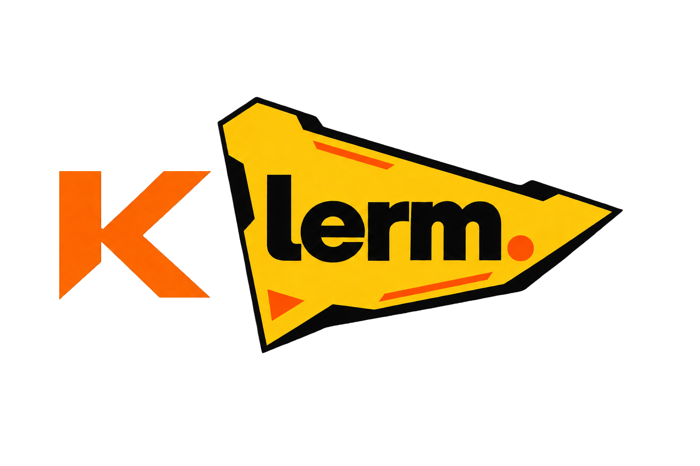

<p align="center">
  
</p>

# Klerm

Klerm is a desktop app and CLI for Personal Agents and coding-agent teams.
Use it to discuss a project, assign tasks, and inspect agents' code changes.

## Personal Agents

Create an assistant with its own name, model, reasoning effort, personality,
and private chat. The app calls this workspace **Personal Bots**.
For example, keep a reviewer for discussing code and a researcher for reading docs.

Reuse a Personal Agent on Kanban cards, Browser tasks, or a built-in Klerm coding
slot. Each task uses its configuration; the conversations remain separate.
Browser and Kanban access are independent switches, off by default. When enabled,
the assistant can browse from its chat or create and run cards assigned to it.

## Working with multiple harnesses

A coding harness is the agent runtime around a model, including its tools,
permissions, authentication, and sessions. Klerm connects supported harnesses
while each keeps its native account and state.

Configure up to four slots in Settings > Agents. Send a prompt to one agent,
or enable **Work together** with two runnable agents. The external team passes
work between a coordinator and peers sequentially, then returns a final response.
With three or more runnable external agents, **Prompt Together** adds bounded
Planner / Builder / Reviewer iterations. Handoffs and tool activity stay visible.

| Harness | Status |
| --- | --- |
| Klerm / inherited Pi runtime | Built-in coding tools and model routing |
| Codex CLI, OpenCode | Native prompt/session adapters connected |
| Hermes | Experimental adapter; end-to-end acceptance and shared Kanban/cron incomplete |
| Claude Code, standalone Pi, Cline | Discovery/setup; prompt bridge not connected yet |

Install and authenticate external harnesses yourself. Discovery does not mean
an agent is runnable. Built-in Klerm routing and the external bridge currently
run separately; unrestricted parallel writing is not supported.

## What else can I do?

- Kanban lets you capture ideas, assign a Personal Agent and folder, run tasks,
  and inspect attempts. Builds need source changes and a successful check after
  the last edit; completed work goes to Review. Schedules run while the backend is alive.
- Browser Agent can read or compare public sites. You can take control, continue,
  or stop. The embedded browser currently requires the Linux development setup.
- Workflows / Graph connects existing agents, cards, and run history.
  It saves and validates drafts; it does not execute workflows yet.
- Organize sessions into projects, edit shared team memory, inspect file diffs,
  run terminal commands, configure MCP tools, and customize shortcuts and themes.

Try asking a Personal Agent to create a planned card for a small fix. Run it in
your project folder, inspect the changed files and checks, then accept the result.

## Start from source

You need Git, Node.js 22.19+ with npm, Rust, and the
[Tauri prerequisites](https://v2.tauri.app/start/prerequisites/) for your OS.
Configure a model provider, running local model, or supported native harness for tasks.

```bash
git clone https://github.com/huncijr/Klerm.git
cd Klerm/harness
npm ci --ignore-scripts
npm run hydrate:model-data
npm run app -- --foreground
```

Select a project folder, configure a provider in Settings, and create or choose
a Personal Bot. Enable Browser/Kanban access when needed. For coding-harness
collaboration, configure runnable slots under Settings > Agents.

The project is actively developed. Linux is the primary checked platform;
Windows/macOS packaging exists but native acceptance remains separate.
Timed intervention and restart-safe external-session recovery are still in development.
Local workers can use Ollama, LM Studio, vLLM, or llama.cpp. A local model is optional.

## Guides

[Personal Agents and Kanban](harness/packages/desktop/PERSONAL_AGENTS.md) · [Graph](harness/packages/desktop/GRAPH_WORKSPACE.md) · [CLI](harness/packages/coding-agent/README.md)
[Windows/macOS/Linux setup](harness/packages/desktop/CROSS_PLATFORM.md) · [Shortcuts](harness/packages/desktop/KEYBOARD_SHORTCUTS.md)
[Browser setup](harness/packages/browser-worker/README.md) · [Self-hosting and Docker](deploy/docker/README.md)

Configuration lives in `~/.klerm/agent/`; task and decision logs live in the active
workspace's `.klerm/`. Coding tools use the launching process's OS permissions.
The initial self-hosted backend has a browser control page, not the full desktop UI.

## License

Klerm is derived from [Pi](https://github.com/earendil-works/pi). Upstream and
previously MIT-licensed material retain their MIT terms. New, expressly marked
Klerm material may use the Community Source License, allowing production use up to
100,000 unique active Klerm users per rolling twelve months. Software you create
with Klerm is outside that audience limit.
See [LICENSE](LICENSE) and [the preserved Pi notice](LICENSES/PI-MIT.txt).
